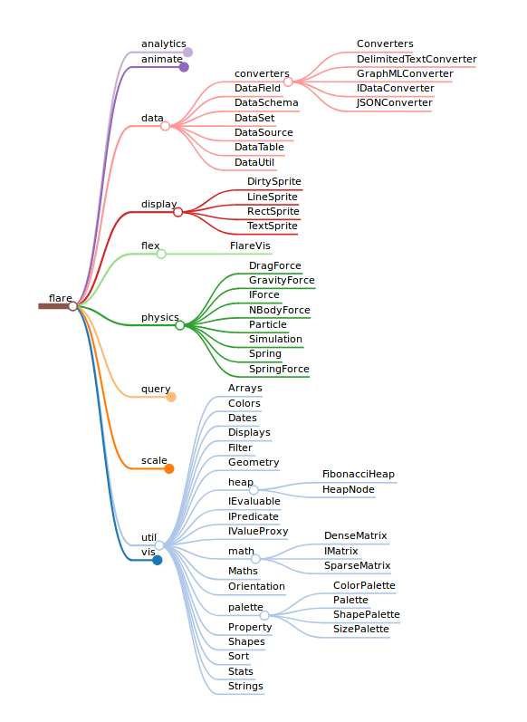

# markmap

[](https://circleci.com/gh/dundalek/markmap) [](https://www.npmjs.com/package/markmap)

*Markmap* is a javascript component that will visualize your markdown documents as mindmaps. It is useful for better navigation and overview of the content. You can see it in action online [here](http://kb.knomaton.org/multi-agent-systems/). It is also used in an [extension](https://atom.io/packages/markdown-mindmap) for Atom editor.

|  |  |
|:-:|:-:|
| Default style | Colorful style |


## Features

- Zoom in and out with the mouse wheel.
- Pan around by dragging the background.
- Expand/collapse children of a node by clicking on the circle.

Supported formats:
- Markdown
- MindMup
- Txtmap (whitespace indented plaintext)
- Pandoc (limited prototype)

Suggestions for new features are welcome, feel free to open an [issue](https://github.com/dundalek/markmap/issues).

## How to use

Install the component with NPM:
```
npm install markmap
```

Visualizing a markdown text consists of two steps:

1. The text is parsed and transformed into a tree representation.
2. The tree is rendered.

### Examples

To run the examples first clone the project and install dependencies:

```sh
git clone https://github.com/dundalek/markmap.git
cd markmap
npm install
```

In the examples code there are imports like `require('../../lib/somefile')`. When using this library in your project you need to change those to `require('markmap/lib/somefile')`.

#### Browser

Run `npm start` and a browser will open with the example page where you can see how different formats are parsed and displayed. The source code for browser examples is located in  [examples/browser](examples/browser) folder.

#### Node.js

Node examples are located in [examples/node](examples/node). You can run the markdown example or others as follows:

```sh
cd examples/node
node example.markdown.js
```

## Changelog

### [0.6.1](https://github.com/dundalek/markmap/compare/v0.6.0...v0.6.1) (2019-10-23)

- Bump dependencies to fix vulnerabilities

### [0.6.0](https://github.com/dundalek/markmap/compare/v0.5.0...v0.6.0) (2018-11-08)

- **Breaking change**: Moved sources from src to lib. That way there will be no breakage if we happen to introduce babel in the future.
- Added tree diffing heuristic
- Added more code examples
- Fixed link parsing issues

### [0.5.0](https://github.com/dundalek/markmap/compare/v0.4.2...v0.5.0) (2018-09-10)

- **Breaking change**: Changed structure of source files
- Added support for parsing inter file links for markdown
- Updated code examples

## License

The MIT License.
